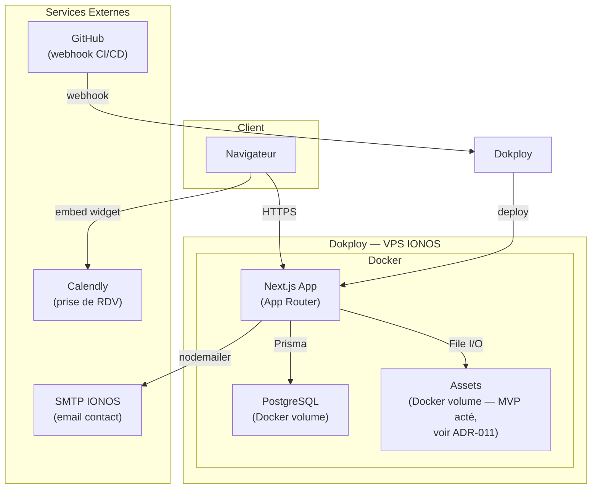
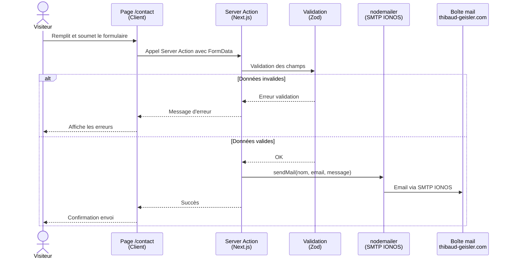
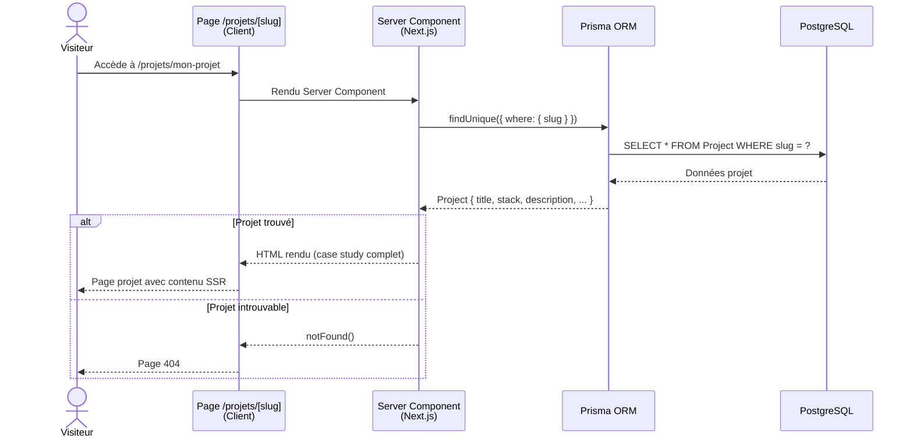

# 🧭 Contexte Projet

## Objectif

Plateforme personnelle servant de vitrine professionnelle et de hub central pour présenter les compétences, projets et services en IA, développement full-stack et formation. Positionnement différenciant : l'IA et l'automatisation constituent la spécialité principale, devant le développement full-stack et la formation IA en entreprise. Conçue pour évoluer vers une plateforme interne de gestion freelance (dashboard, CRM, outils), sans sur-ingénierie initiale.

Le site ne démo pas les applications lui-même : il sert de répertoire central pointant vers des démos autonomes hébergées sur leurs propres domaines.

## Type de Projet

Monolithe web fullstack — application Next.js unique couvrant le site public et le dashboard admin (post-MVP), hébergée en self-hosted via Dokploy.

## Enjeux & Contraintes

- **Budget** : faible, priorité aux solutions self-hosted pour limiter les coûts opérationnels
- **Équipe** : 1 personne (développement, design, contenu)
- **Timeline MVP** : quelques semaines — portfolio fonctionnel et crédible rapidement
- **Performance** : temps de chargement rapide pour les pages publiques (SEO, crédibilité)
- **Sécurité** : pages publiques ouvertes, dashboard privé protégé, chatbot futur soumis à rate limiting
- **Scalabilité** : trafic initial faible, architecture pouvant évoluer sans refonte majeure
- **Périmètre** : outil personnel single-user — pas un SaaS, pas de multi-tenant, pas de gestion multi-utilisateur prévue

## Public Cible

- **Clients potentiels** (PME, startups, entreprises) : décideurs et équipes techniques cherchant un prestataire IA/full-stack
- **Recruteurs et partenaires** : évaluation du niveau technique
- **Visiteurs** (post-MVP) : utilisateurs du chatbot IA public

---

# 🏗️ Architecture Globale

## Architecture — Approche Générale

Monolithe modulaire Next.js App Router : une seule application couvrant les pages publiques, les API routes et le dashboard admin futur. Séparation logique par route groups (`(public)/` et `(admin)/`) sans séparation physique frontend/backend.

Voir [ADR-001](adrs/001-monolithe-nextjs-fullstack.md) pour la justification de ce choix.

## Organisation du Code

### Type de Repo

Single repository (monolithe) — pas de monorepo. Voir [ADR-008](adrs/008-single-repository.md).

### Package Manager

pnpm

### Apps & Packages

| Nom | Chemin | Rôle | Package Manager |
|-----|--------|------|------------------|
| Portfolio App | `/` | Application Next.js unique (pages publiques + API + dashboard) | |

## Composants Principaux (Haut Niveau)

- **Frontend** : Pages publiques React (SSG/SSR) + Dashboard admin (post-MVP)
- **Backend** : Server Actions + API Routes Next.js
- **Données** : PostgreSQL + Prisma (projets, assets, leads post-MVP)
- **Assets** : volumes Docker pour le MVP (voir [ADR-011](adrs/011-stockage-assets.md)) — servis via route API `/api/assets/[filename]`, jamais depuis `public/`
- **Sécurité** : Middleware Next.js (headers, protection routes admin) + Better Auth avec Google OAuth (dashboard post-MVP)
- **Intégrations Externes** : SMTP IONOS (contact), Calendly (prise de RDV)

## Diagrammes d'Architecture



## Flux Fonctionnels (Use-cases critiques)

### Use-case 1 : Affichage de la liste des projets

1. Visiteur accède à `/projets`
2. Next.js Server Component exécute une query Prisma (`findMany`)
3. La liste des projets est rendue côté serveur (SSR)
4. Chaque projet affiche titre, stack, lien GitHub, lien démo externe
5. Filtrage par type (client / personnel) disponible sur la page

### Use-case 2 : Soumission du formulaire de contact

1. Visiteur remplit le formulaire sur `/contact`
2. Soumission via Server Action
3. Validation des données (Zod)
4. Envoi email via SMTP IONOS (nodemailer)
5. Réponse : confirmation ou message d'erreur

### Use-case 3 : Affichage d'une page projet (case study)

1. Visiteur accède à `/projets/[slug]`
2. Next.js query Prisma sur le slug
3. Rendu SSR de la page détail (contexte, défis, solution, screenshots, liens)
4. `generateStaticParams` pour pré-générer les slugs connus (SEO)

Voir [ADR-003](adrs/003-case-studies-pages-dedicees.md) pour le choix pages dédiées vs modales.

## Patterns Utilisés

| Pattern | Contexte d'application |
|---------|------------------------|
| **SSG** (Static Site Generation) | Pages sans données variables à la requête (accueil, services, contact) |
| **SSR** (Server-Side Rendering) | Pages avec données BDD (liste projets `/projets`, case study `/projets/[slug]`) |
| **Server Actions** | Mutations côté serveur sans API route dédiée (formulaire contact, CRUD projets post-MVP) |
| **ISR** (Incremental Static Regeneration) | Post-MVP : revalidation périodique des pages projets sans redéploiement complet |
| **RAG** (Retrieval-Augmented Generation) | Post-MVP : chatbot IA enrichi par pgvector (recherche sémantique dans PostgreSQL) |

---

# 🌐 Architecture Technique

## 🎨 Frontend

### Framework

Next.js (App Router) — TypeScript strict

### Styling & UI

- **Web** : Option C actée — shadcn/ui hybride + Magic UI / Aceternity UI pour effets visuels (voir [ADR-009](adrs/009-ui-system.md))
- **Dark/Light mode** : prévu via CSS variables / `next-themes`
- **i18n** : FR/EN — voir [ADR-010](adrs/010-i18n.md)

### State Management

Server Components + `useState`/`useReducer` pour l'état local uniquement. Pas de librairie de state global (pas de besoin identifié pour le MVP).

### Navigation

Routing file-based via Next.js App Router — pas de librairie de navigation externe. Les routes sont définies par la structure de fichiers dans `src/app/`.

### Structure du Code

```
src/
├── app/                    # App Router
│   ├── (public)/           # Route group pages publiques
│   │   ├── page.tsx        # Accueil
│   │   ├── services/
│   │   ├── projets/
│   │   │   └── [slug]/     # Case study
│   │   ├── a-propos/
│   │   └── contact/
│   ├── (admin)/            # Route group dashboard (post-MVP)
│   │   └── dashboard/
│   ├── api/                # API routes
│   └── layout.tsx
├── components/
│   ├── ui/                 # Composants UI primitifs
│   └── features/           # Composants métier
├── lib/                    # Utilitaires, config, logger (Pino)
├── server/                 # Server Actions + queries Prisma
│   ├── actions/
│   └── queries/
└── types/                  # Types TypeScript partagés
```

### Services Externes (côté client)

- **Calendly** : widget embed sur la page Contact

## 💻 Backend

### Runtime & Langage

Node.js — TypeScript strict

### Framework

Next.js (App Router, Server Actions + API Routes). Caching opt-in : pages dynamiques par défaut, cache activé explicitement par page.

### Structure du Code

Monolithe modulaire — logique serveur dans `src/server/` (actions et queries séparés). Pas de DDD ni Clean Architecture : le domaine métier est simple (CRUD sur Project et Asset), l'équipe est solo et les règles métier ne changent pas indépendamment de l'infrastructure. La séparation `actions/` + `queries/` + `types/` fournit le découplage utile sans overhead.

### API

- **Server Actions** : mutations (formulaire contact, CRUD projets post-MVP)
- **API Routes** (`/api/`) : endpoints consommés par des clients tiers si besoin (chatbot post-MVP, webhooks n8n)

### Sécurité Backend

- **AuthN** : Better Auth avec Google OAuth comme unique provider (Gmail pro + whitelist email single-user) — post-MVP dashboard uniquement (voir [ADR-002](adrs/002-auth-better-auth-google-oauth.md))
- **AuthZ** : Middleware Next.js protégeant les routes `(admin)/` par vérification de session Better Auth
- **Durcissement** : Security headers via la configuration Next.js, rate limiting dans les route handlers des endpoints publics (pas dans la couche middleware)

### Services Externes

- **nodemailer** : envoi SMTP via IONOS (formulaire contact)
- **API LLM** (post-MVP) : à décider (voir [ADR-012](adrs/012-api-llm-chatbot-rag.md))
- **n8n** (post-MVP) : couche d'intégration universelle pour workflows externes (contenu, leads, RAG). Toute intégration avec des services tiers (Notion inclus) passe par n8n, pas par une API directe.
- **Indy API** (post-MVP) : intégration comptabilité freelance (devis, factures)
- **LinkedIn API** (post-MVP) : synchronisation contenu / automatisation prospection

## 🗄️ Données (Base de Données)

### Base de Données Principale

PostgreSQL — conteneurisé via Docker, volume persistant. Extension pgvector prévue post-MVP pour le RAG du chatbot. Voir [ADR-004](adrs/004-postgresql-des-le-mvp.md).

### Approche Modélisation

Relationnelle classique — entités simples pour le MVP (`Project`, `Asset`)

### ORM/ODM

Prisma (type-safe, migrations intégrées)

### Migrations & Versioning

Prisma Migrate — migrations versionnées dans `prisma/migrations/`

## 🗃️ Données & Cache

### Cache

Cache Next.js natif (data cache, full route cache). ISR envisageable post-MVP pour les pages à contenu dynamique (projets, case studies).

### Files / Assets Storage

Volumes Docker pour le MVP (voir [ADR-011](adrs/011-stockage-assets.md)). Assets servis via route API `/api/assets/[filename]`, jamais depuis `public/` (couplage au build, incompatible avec du contenu dynamique). Migration vers Cloudflare R2 au moment du dashboard upload.

### File Processing

Optimisation images via `next/image` (built-in). Pas de pipeline dédié pour le MVP.

### Message Queue / Event Streaming

n8n self-hosted (post-MVP) : orchestration de workflows asynchrones (automatisation de leads entrants, pipeline RAG, webhooks inter-services). Déployé comme service indépendant via Docker Compose sur Dokploy — aucun couplage direct avec l'application Next.js (communication par webhooks HTTP).

---

# 🔄 Diagramme de Séquence

Flux critique : soumission du formulaire de contact.



Flux secondaire : affichage d'une page projet (case study).



---

# 🛠️ Infrastructure, Sécurité & Observabilité

## 🚀 Infrastructure

### Hébergement

VPS IONOS — Dokploy self-hosted. Déploiement automatique via webhook GitHub sur merge sur `main`. Voir [ADR-005](adrs/005-hebergement-dokploy-vs-vercel.md).

### Conteneurisation

Docker + Docker Compose — services : `nextjs`, `postgres`

### CI/CD

GitHub Actions : lint + tests uniquement. Le déploiement est entièrement géré par Dokploy (webhook GitHub sur merge `main` → rebuild + redéploiement automatique).

### Environnements

| Environnement | Description | Config |
|---------------|-------------|--------|
| `development` | Local sur machine dev | `.env.local` |
| `production` | VPS IONOS via Dokploy | Variables d'env Dokploy |

### Sécurité Infrastructure

- **Secrets** : variables d'environnement gérées dans Dokploy (jamais dans le repo)
- **Réseau** : seuls les ports 80/443 exposés publiquement (reverse proxy Dokploy)
- **HTTPS** : TLS automatique via Dokploy (Let's Encrypt)

### Scalabilité & Performance

- **Scalabilité** : verticale (upgrade VPS) si besoin — trafic initial faible
- **Performance frontend** : SSG pour les pages statiques, SSR pour les pages dynamiques, `next/image` pour l'optimisation des images
- **Cache** : Cache Next.js natif (ISR si besoin post-MVP)

## 🔐 Sécurité Globale

### Stratégie Sécurité

OWASP Top 10 comme référence — durcissement des headers, validation stricte des entrées, pas de données sensibles en clair.

### Authentification

Better Auth avec Google OAuth comme unique provider. Whitelist email single-user via hook `databaseHooks.user.create.before` (seul le Gmail pro autorisé peut créer un compte). Uniquement pour le dashboard admin (post-MVP). Pages publiques sans auth. Voir [ADR-002](adrs/002-auth-better-auth-google-oauth.md).

### Autorisation

Middleware Next.js : protection des routes `(admin)/` par vérification de session Better Auth.

### Protection API

- **Rate limiting formulaire contact** : compteur IP in-memory simple dans la Server Action — décision d'implémentation, pas d'ADR dédié
- **Rate limiting chatbot** (post-MVP) : décision architecturale à prendre (coût LLM en jeu) — voir [ADR-014](adrs/014-rate-limiting-chatbot.md)
- **CORS** : configuration stricte dans la configuration Next.js
- **Validation** : Zod sur toutes les entrées utilisateur (Server Actions + API routes)

### Protection Données

- **Transit** : HTTPS/TLS obligatoire (Dokploy + Let's Encrypt)
- **Repos** : pas de données sensibles stockées en dehors de la BDD PostgreSQL (accès réseau interne Docker uniquement)

## 📊 Observabilité

### Logs

Pino — logger JSON structuré. Output stdout, visible dans l'onglet Logs de Dokploy. Niveaux : `info`, `warn`, `error`. *(Choix retenu — aucun ADR dédié.)*

### Monitoring

TBD — Umami analytics self-hosted prévu post-MVP (RGPD-friendly, sans cookies, compatible PostgreSQL). Voir [ADR-007](adrs/007-analytics-umami.md).

### Alerts

TBD post-MVP.

## 🧪 Tests

### Stratégie de Tests

- **Tests unitaires** : fonctions pures, helpers, Server Actions critiques, schémas Zod
- **Tests d'intégration** : routes à effets de bord — formulaire contact (SMTP mock, requêtes Prisma sur PostgreSQL de test), routes CRUD dashboard admin (post-MVP)
- **Tests e2e** : non prévus pour le MVP (ajout si le dashboard devient complexe)

### Tools

- **Vitest** : tests unitaires et intégration *(choix retenu — aucun ADR dédié)*
- **Testing Library** : rendu et interaction composants React *(choix retenu — aucun ADR dédié)*

### Environnement de Test

- **CI** : service container PostgreSQL éphémère (GitHub Actions), créé pour la durée du job et détruit automatiquement
- **Local** : base `portfolio_test` séparée de `portfolio_dev`
- **Services externes** : SMTP toujours mocké — les appels nodemailer ne sont jamais réels

### Coverage

Pas d'objectif de coverage pour le MVP. Priorité aux chemins critiques (formulaire contact, mutations BDD).

---

# 📝 Diagrammes & ADRs

## Diagrammes

- **Diagramme de composants** : voir section Architecture Globale
- **Diagramme de séquence** : voir section Diagramme de Séquence

## ADRs (Architecture Decision Records)

### Décisions actées

- [ADR-001 : Monolithe Next.js fullstack](adrs/001-monolithe-nextjs-fullstack.md)
- [ADR-002 : Authentification Better Auth + Google OAuth](adrs/002-auth-better-auth-google-oauth.md)
- [ADR-003 : Case studies en pages dédiées](adrs/003-case-studies-pages-dedicees.md)
- [ADR-004 : PostgreSQL dès le MVP](adrs/004-postgresql-des-le-mvp.md)
- [ADR-005 : Hébergement Dokploy self-hosted](adrs/005-hebergement-dokploy-vs-vercel.md)
- [ADR-006 : Stratégie démos — hub vers domaines autonomes](adrs/006-strategie-demos-hub.md)
- [ADR-007 : Analytics Umami self-hosted](adrs/007-analytics-umami.md)
- [ADR-008 : Single repository](adrs/008-single-repository.md)
- [ADR-009 : UI System — shadcn/ui hybride + effets visuels](adrs/009-ui-system.md)
- [ADR-010 : i18n — next-intl](adrs/010-i18n.md)
- [ADR-011 : Stockage assets — volumes Docker MVP, R2 post-MVP](adrs/011-stockage-assets.md)
- [ADR-013 : Blog — PostgreSQL](adrs/013-blog-stockage.md)

### À décider

- [ADR-012 : API LLM pour le chatbot RAG](adrs/012-api-llm-chatbot-rag.md)
- [ADR-014 : Rate limiting chatbot public](adrs/014-rate-limiting-chatbot.md)

---

# 🚀 Évolutions Futures (Post-MVP)

- **Dashboard admin** : interface privée single-user (Better Auth + Google OAuth, CRUD projets, gestion assets, suivi leads, gestion articles blog, génération IA de contenu)
- **Chatbot RAG** : chatbot public IA, vitrine de compétences, alimenté par pgvector + PostgreSQL (voir ADR-012)
- **Mini-CRM** : suivi prospects/clients, remplacement progressif de Notion (migration one-shot manuelle)
- **Umami analytics** : self-hosted sur Dokploy, RGPD-friendly (voir ADR-007)
- **n8n** : orchestration workflows (automatisation leads, pipeline RAG, webhooks entre services) self-hosted sur Dokploy
- **Blog** : articles techniques/tutoriels pour le SEO, stockés en PostgreSQL, gérés via dashboard (voir ADR-013)
- **Génération IA de contenu** : outil dashboard — input (sujet/projet/URL), output ébauches d'articles + déclinaisons réseaux, brouillons en table `Article` (status: draft | published | archived)
- **Intégrations** : Indy API (comptabilité), LinkedIn (contenu/prospection) — tout workflow avec des services tiers (Notion inclus) passe par n8n

---

# 🔗 Ressources

## Documentation Officielle

- [Next.js](https://nextjs.org/docs)
- [Prisma](https://www.prisma.io/docs)
- [Better Auth](https://better-auth.com/docs)
- [Dokploy](https://dokploy.com/docs)
- [Pino](https://getpino.io)

## Ressources Complémentaires

- [shadcn/ui](https://ui.shadcn.com) — bibliothèque UI retenue (ADR-009)
- [Magic UI](https://magicui.design) — effets visuels copy-paste (ADR-009)
- [Aceternity UI](https://ui.aceternity.com) — effets visuels copy-paste (ADR-009)
- [next-intl](https://next-intl-docs.vercel.app) — i18n App Router retenu (ADR-010)
- [Umami Analytics](https://umami.is/docs)
