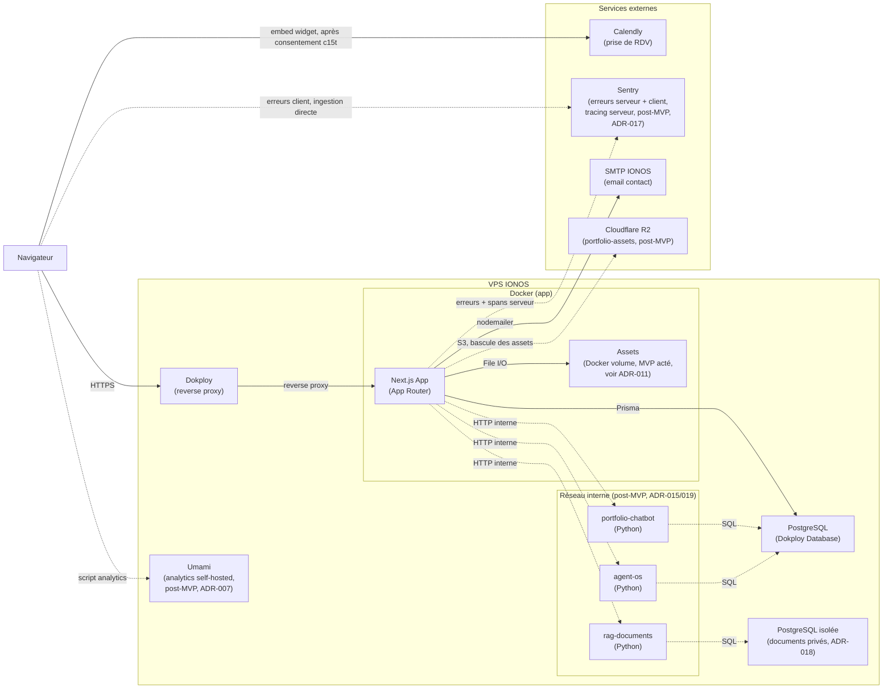
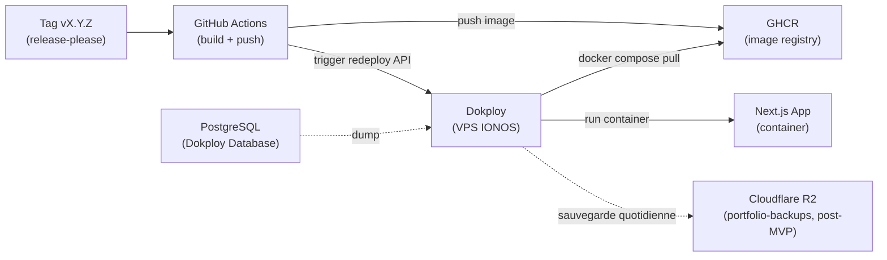
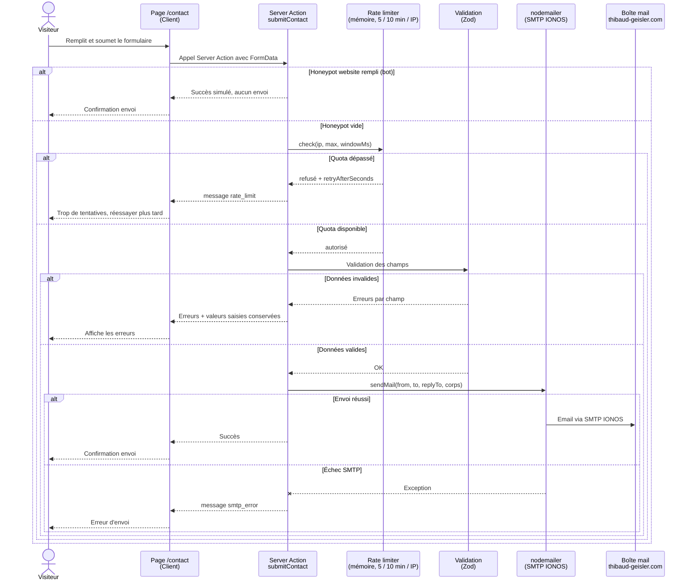
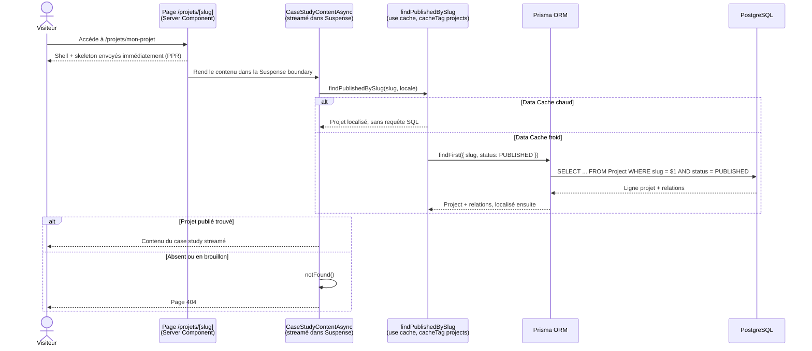

# 🧭 Contexte Projet

## Objectif

Plateforme personnelle servant de vitrine professionnelle et de hub central pour présenter les compétences, projets et services en IA, développement full-stack et formation. Positionnement différenciant : l'IA et l'automatisation constituent la spécialité principale, devant le développement full-stack et la formation IA en entreprise. Conçue pour évoluer vers une plateforme interne de gestion freelance (espace admin, CRM, outils), sans sur-ingénierie initiale.

Le site ne démo pas les applications lui-même : il sert de répertoire central pointant vers des démos autonomes hébergées sur leurs propres domaines.

## Type de Projet

Monolithe web fullstack : application Next.js unique couvrant le site public et l'espace admin (post-MVP), hébergée en self-hosted via Dokploy.

## Enjeux & Contraintes

- **Budget** : faible, priorité aux solutions self-hosted pour limiter les coûts opérationnels
- **Équipe** : 1 personne (développement, design, contenu)
- **Timeline MVP** : quelques semaines, portfolio fonctionnel et crédible rapidement
- **Performance** : temps de chargement rapide pour les pages publiques (SEO, crédibilité)
- **Sécurité** : pages publiques ouvertes, espace admin privé protégé, chatbot futur soumis à rate limiting
- **Scalabilité** : trafic initial faible, architecture pouvant évoluer sans refonte majeure
- **Périmètre** : outil personnel single-user, pas un SaaS, pas de multi-tenant, pas de gestion multi-utilisateur prévue

## Public Cible

- **Clients potentiels** (PME, startups, entreprises) : décideurs et équipes techniques cherchant un prestataire IA/full-stack
- **Recruteurs et partenaires** : évaluation du niveau technique
- **Visiteurs** (post-MVP) : utilisateurs du chatbot IA public

---

# 🏗️ Architecture Globale

## Architecture : Approche Générale

Monolithe modulaire Next.js App Router : une seule application couvrant les pages publiques, les API routes et l'espace admin futur. Séparation logique par le route group `(public)/` sous `[locale]/` et le segment `admin/` à la racine de `app/`, sans séparation physique frontend/backend.

Voir [ADR-001](adrs/001-monolithe-nextjs-fullstack.md) pour la justification de ce choix.

## Organisation du Code

### Type de Repo

Single repository, pas de monorepo. Voir [ADR-008](adrs/008-single-repository.md), dont la portée reste ce dépôt TypeScript : les services Python de l'écosystème ont chacun le leur (voir [ADR-015](adrs/015-decoupage-services.md)).

### Package Manager

pnpm

### Apps & Packages

| Nom | Chemin | Rôle | Langage |
|-----|--------|------|---------|
| Portfolio App | `/` | Ce dépôt : site public, espace admin, tous les fronts, auth, CRUD | TypeScript |

**Dépôts voisins** (post-MVP, hors de celui-ci, voir [ADR-015](adrs/015-decoupage-services.md)) : `ai-kit` (socle IA partagé), `agent-os` (exécution de `claude -p` : cycle de dev et jobs de l'espace admin), `portfolio-chatbot` (RAG public), `rag-documents` (documents personnels, base isolée). `ai-kit` est un **package Python** installé par les trois autres, pas un service. Les trois services sont joints en HTTP sur le réseau Docker interne, jamais exposés ([ADR-019](adrs/019-communication-inter-services.md)).

## Composants Principaux (Haut Niveau)

- **Frontend** : Pages publiques React (Partial Prerendering + `'use cache'`) + espace admin sous `/admin`, hors `[locale]` (post-MVP, voir [ADR-021](adrs/021-routing-espace-admin.md))
- **Backend** : Server Actions + API Routes Next.js. Ce dépôt porte les fronts et le CRUD synchrone, les traitements longs et l'IA vivent dans les services voisins ([ADR-020](adrs/020-portfolio-bff.md))
- **Données** : PostgreSQL externe via Dokploy Database + Prisma 7. Le client Prisma est généré dans `src/generated/prisma/` (gitignored). En production `DATABASE_URL` pointe vers le DNS interne Dokploy de la Database. Découpage en schemas par domaine post-MVP ([ADR-018](adrs/018-cloisonnement-donnees.md))
- **Assets** : volumes Docker pour le MVP (voir [ADR-011](adrs/011-stockage-assets.md)), servis via route API catch-all `/api/assets/[...path]` (sous-dossiers `projets/{client,personal}/<slug>/<filename>`), jamais depuis `public/`
- **Sécurité** : `src/proxy.ts` (locale routing, et vérification du cookie de session sur `/admin` post-MVP) + security headers dans `next.config.ts` + Better Auth avec Google OAuth (post-MVP)
- **Conformité cookies / RGPD** : `@c15t/nextjs` (Consent Manager Provider, `ConsentBanner`, `ConsentDialog`) côté client, gating du widget Calendly tant que la catégorie `marketing` n'est pas accordée
- **Intégrations Externes** : SMTP IONOS (contact), Calendly (prise de RDV, chargé après consentement marketing via c15t)

## Diagrammes d'Architecture

Trait plein : en place aujourd'hui. Trait pointillé : prévu post-MVP.

### Runtime


```mermaid
graph LR
    Browser["Navigateur"]

    subgraph VPS["VPS IONOS"]
        Dokploy["Dokploy<br/>(reverse proxy)"]
        subgraph App["Docker (app)"]
            Next["Next.js App<br/>(App Router)"]
            Assets["Assets<br/>(Docker volume, MVP acté,<br/>voir ADR-011)"]
        end
        PG["PostgreSQL<br/>(Dokploy Database)"]
        Umami["Umami<br/>(analytics self-hosted,<br/>post-MVP, ADR-007)"]
        subgraph Interne["Réseau interne (post-MVP, ADR-015/019)"]
            Chatbot["portfolio-chatbot<br/>(Python)"]
            AgentOS["agent-os<br/>(Python)"]
            RagDocs["rag-documents<br/>(Python)"]
        end
        PGPriv["PostgreSQL isolée<br/>(documents privés, ADR-018)"]
    end

    subgraph Ext["Services externes"]
        Calendly["Calendly<br/>(prise de RDV)"]
        Sentry["Sentry<br/>(erreurs serveur + client,<br/>tracing serveur, post-MVP,<br/>ADR-017)"]
        SMTP["SMTP IONOS<br/>(email contact)"]
        R2["Cloudflare R2<br/>(portfolio-assets, post-MVP)"]
    end

    Browser -->|HTTPS| Dokploy -->|reverse proxy| Next
    Browser -->|embed widget, après consentement c15t| Calendly
    Browser -.->|script analytics| Umami
    Browser -.->|erreurs client, ingestion directe| Sentry
    Next -->|Prisma| PG
    Next -->|File I/O| Assets
    Next -.->|HTTP interne| Chatbot
    Next -.->|HTTP interne| AgentOS
    Next -.->|HTTP interne| RagDocs
    Next -->|nodemailer| SMTP
    Next -.->|erreurs + spans serveur| Sentry
    Next -.->|S3, bascule des assets| R2
    Chatbot -.->|SQL| PG
    AgentOS -.->|SQL| PG
    RagDocs -.->|SQL| PGPriv
```

### Livraison et sauvegarde


```mermaid
graph LR
    Tag["Tag vX.Y.Z<br/>(release-please)"]
    GHA["GitHub Actions<br/>(build + push)"]
    GHCR["GHCR<br/>(image registry)"]
    Dokploy["Dokploy<br/>(VPS IONOS)"]
    Next["Next.js App<br/>(container)"]
    PG["PostgreSQL<br/>(Dokploy Database)"]
    R2["Cloudflare R2<br/>(portfolio-backups, post-MVP)"]

    Tag --> GHA
    GHA -->|push image| GHCR
    GHA -->|trigger redeploy API| Dokploy
    Dokploy -->|docker compose pull| GHCR
    Dokploy -->|run container| Next
    PG -.->|dump| Dokploy
    Dokploy -.->|sauvegarde quotidienne| R2
```

## Flux Fonctionnels (Use-cases critiques)

### Use-case 1 : Affichage de la liste des projets

1. Visiteur accède à `/projets`
2. Page entièrement pré-rendue au build (Server Component async wrapped `'use cache'` + `cacheTag('projects')`), aucun Suspense (règle `'use cache'` XOR `<Suspense>`)
3. Le static shell complet est servi depuis le Data Cache, premier hit ultra-rapide
4. Chaque projet affiche titre, stack, lien GitHub, lien démo externe
5. Filtrage par type (client / personnel) disponible sur la page

### Use-case 2 : Soumission du formulaire de contact

1. Visiteur remplit le formulaire sur `/contact`
2. Soumission via Server Action
3. Honeypot : si le champ `website` est rempli, succès simulé et aucun envoi
4. Rate limiting en mémoire, 5 tentatives par IP sur 10 minutes, au-delà retour `rate_limit`
5. Validation des données (Zod), erreurs renvoyées par champ avec les valeurs saisies
6. Envoi email via SMTP IONOS (nodemailer)
7. Réponse : confirmation, ou `smtp_error` si l'envoi échoue

### Use-case 3 : Affichage d'une page projet (case study)

1. Visiteur accède à `/projets/[slug]`
2. Next.js query Prisma sur le slug (wrapped `'use cache'` + `cacheTag('projects')`)
3. Rendu dynamique à la demande au premier hit, puis servi depuis le Data Cache jusqu'à revalidation

Voir [ADR-003](adrs/003-case-studies-pages-dedicees.md) pour le choix pages dédiées vs modales.

## Patterns Utilisés

| Pattern | Contexte d'application |
|---------|------------------------|
| **Partial Prerendering (PPR)** | Modèle par défaut Next 16 activé via `cacheComponents: true` : shell statique pré-rendu au build + zones dynamiques streamées au runtime (wrappées `<Suspense>`) |
| **`'use cache'`** | Directive de cache opt-in sur queries Prisma (`cacheLife('hours' \| 'days' \| 'max')` + `cacheTag`) : Data Cache persistant en self-hosted, revalidation ciblée via `revalidateTag` |
| **Server Actions** | Mutations côté serveur sans API route dédiée (formulaire contact, CRUD projets post-MVP) |
| **RAG** (Retrieval-Augmented Generation) | Post-MVP : chatbot IA enrichi par pgvector (recherche sémantique dans PostgreSQL) |

---

# 🌐 Architecture Technique

## 🎨 Frontend

### Framework

Next.js (App Router), TypeScript strict

### Styling & UI

- **Web** : Option C actée, shadcn/ui hybride + Magic UI / Aceternity UI pour effets visuels (voir [ADR-009](adrs/009-ui-system.md))
- **Dark/Light mode** : prévu via CSS variables / `next-themes`
- **i18n** : FR/EN, voir [ADR-010](adrs/010-i18n.md)

### State Management

Server Components + `useState`/`useReducer` pour l'état local uniquement. Pas de librairie de state global (pas de besoin identifié pour le MVP).

### Navigation

Routing file-based via Next.js App Router, pas de librairie de navigation externe. Les routes sont définies par la structure de fichiers dans `src/app/`.

### Structure du Code

```
src/
├── app/                          # App Router
│   ├── [locale]/                 # Segment dynamique next-intl (FR/EN), obligatoire pour routing localisé
│   │   ├── (public)/             # Route group pages publiques
│   │   │   ├── page.tsx          # Accueil
│   │   │   ├── services/
│   │   │   ├── projets/
│   │   │   │   └── [slug]/       # Case study
│   │   │   ├── a-propos/
│   │   │   └── contact/
│   │   ├── error.tsx
│   │   ├── loading.tsx
│   │   └── not-found.tsx
│   ├── admin/                    # Espace admin (post-MVP), HORS [locale] : français seul (ADR-021)
│   ├── api/                      # API routes (hors [locale])
│   ├── providers.tsx             # Providers client (theme, c15t Consent Manager)
│   └── layout.tsx
├── components/
│   ├── ui/                       # Composants UI primitifs (shadcn)
│   ├── magicui/                  # Effets visuels Magic UI
│   ├── aceternity/               # Effets visuels Aceternity UI
│   ├── cookies/                  # Composants liés au consentement c15t
│   ├── layout/                   # Navbar, footer, switchers
│   └── features/                 # Composants métier par domaine
├── config/                       # Données de config statiques (nav-items, social-links, expertise)
├── env.ts                        # Validation runtime env vars (@t3-oss/env-nextjs + Zod, server vs client)
├── i18n/                         # Setup next-intl (routing, request, locale-guard, navigation, types)
├── lib/                          # Utilitaires, schemas Zod, logger (Pino), helpers SEO/cookies
├── server/                       # Server Actions + queries Prisma + config serveur
│   ├── actions/
│   ├── config/
│   └── queries/
├── generated/                    # Sortie du générateur Prisma 7 (`src/generated/prisma`), gitignored
├── types/                        # Types TypeScript partagés
└── proxy.ts                      # Routing i18n, puis vérification de session sur /admin (post-MVP).
                                  # Les security headers sont dans next.config.ts
```

### Services Externes (côté client)

- **Calendly** : widget embed sur la page Contact, chargé conditionnellement via `react-calendly` uniquement après consentement de la catégorie `marketing` (CMP c15t, voir section Conformité cookies)
- **c15t Consent Manager** (`@c15t/nextjs`) : bannière + dialog de gestion des cookies, mode `offline` (état persisté côté client), i18n FR/EN synchronisé avec next-intl via `ConsentLanguageSync`

## 💻 Backend

### Runtime & Langage

Node.js, TypeScript strict

### Framework

Next.js (App Router, Server Actions + API Routes). Caching opt-in granulaire (composant/fonction) via directive `'use cache'` : contenu dynamique par défaut, cache activé explicitement sur les queries Prisma.

### Structure du Code

Monolithe modulaire : logique serveur dans `src/server/` (actions et queries séparés). Pas de DDD ni Clean Architecture : le domaine métier est simple (CRUD sur `Project` et entités liées, plus métadonnées légales statiques), l'équipe est solo et les règles métier ne changent pas indépendamment de l'infrastructure. La séparation `actions/` + `queries/` + `config/` + `types/` fournit le découplage utile sans overhead.

### API

- **Server Actions** : mutations (formulaire contact, CRUD projets post-MVP)
- **API Routes** (`/api/`) : endpoints consommés par des clients tiers si besoin (chatbot post-MVP)

### Sécurité Backend

- **AuthN** : Better Auth avec Google OAuth comme unique provider (Gmail pro + whitelist email single-user), post-MVP, espace admin uniquement (voir [ADR-002](adrs/002-auth-better-auth-google-oauth.md))
- **AuthZ** : proxy Next.js protégeant les routes `/admin` par vérification du cookie de session, doublé d'un `getCurrentUser()` dans le layout protégé
- **Durcissement** : Security headers via la configuration Next.js, rate limiting dans les route handlers des endpoints publics (pas dans la couche middleware)

### Services Externes

- **nodemailer** : envoi SMTP via IONOS (formulaire contact)
- **API LLM** (post-MVP) : mode d'accès tranché par [ADR-016](adrs/016-acces-llm.md), choix du modèle par [ADR-012](adrs/012-api-llm-chatbot-rag.md). Aucun appel direct depuis ce dépôt : les services IA voisins portent ces appels
- **Indy API** (post-MVP, à réévaluer) : la comptabilité étant tenue en interne, cette intégration ne garde de sens que pour les déclarations et l'export comptable
- **LinkedIn API** (post-MVP, à étudier) : publication assistée et prospection, sous réserve des limites de l'API officielle

## 🗄️ Données (Base de Données)

### Base de Données Principale

PostgreSQL géré comme service Dokploy Database autonome (plus de service `postgres` dans le compose applicatif, il ne subsiste qu'en `compose.override.yaml` pour le développement local). En production, `DATABASE_URL` pointe vers le DNS interne Dokploy de la Database. Volume persistant géré par Dokploy. Extension pgvector prévue post-MVP. Voir [ADR-004](adrs/004-postgresql-des-le-mvp.md).

Post-MVP, la base se découpe en schemas par domaine (`public`, `auth`, `freelance`, `dev`, `rag_public`) et une **seconde base isolée** accueille les documents personnels, avec ses propres credentials. Un seul propriétaire par schema. Voir [ADR-018](adrs/018-cloisonnement-donnees.md).

### Approche Modélisation

Relationnelle classique. Modèles présents dans `prisma/schema.prisma` au MVP :

- **Domaine projets** : `Project`, `ClientMeta`, `Company`, `Tag`, `ProjectTag`
- **Domaine légal / mentions / RGPD** : `Address`, `LegalEntity`, `Publisher`, `DataProcessing`

Les enums associés (`ProjectType`, `ProjectStatus`, `ProjectFormat`, `TagKind`, `CompanySector`, `LegalBasis`, `DataCategory`, etc.) sont déclarés dans le même fichier. Les assets binaires ne sont pas modélisés en BDD : ils sont stockés sur disque (volume Docker) et référencés par filename depuis `Project.coverFilename` ou `Company.logoFilename` (voir [ADR-011](adrs/011-stockage-assets.md)).

### ORM/ODM

Prisma (type-safe, migrations intégrées)

### Migrations & Versioning

Prisma Migrate, migrations versionnées dans `prisma/migrations/`

## 🗃️ Données & Cache

### Cache

Data Cache Next 16 opt-in via directive `'use cache'` sur les queries Prisma, avec `cacheLife('hours')` + `cacheTag('projects')` pour revalidation ciblée (`revalidateTag` depuis les Server Actions admin post-MVP).

### Files / Assets Storage

Volumes Docker pour le MVP (voir [ADR-011](adrs/011-stockage-assets.md)). Assets servis via route API catch-all `/api/assets/[...path]` organisée en sous-dossiers `projets/{client,personal}/<slug>/<filename>`, jamais depuis `public/` (couplage au build, incompatible avec du contenu dynamique). Migration vers Cloudflare R2 au moment de l'upload depuis l'espace admin.

### File Processing

Optimisation images via `next/image` (built-in). Pas de pipeline dédié pour le MVP.

### Message Queue / Event Streaming

Aucun bus de messages ni broker d'événements. Les files de jobs post-MVP vivent dans `agent-os` et tiennent en PostgreSQL ([ADR-019](adrs/019-communication-inter-services.md)), les appels inter-services sont synchrones en HTTP interne.

---

# 🔄 Diagramme de Séquence

Flux critique : soumission du formulaire de contact.


```mermaid
sequenceDiagram
    actor Visiteur
    participant Page as Page /contact<br>(Client)
    participant Action as Server Action<br>submitContact
    participant Limiter as Rate limiter<br>(mémoire, 5 / 10 min / IP)
    participant Zod as Validation<br>(Zod)
    participant Mailer as nodemailer<br>(SMTP IONOS)
    participant Email as Boîte mail<br>thibaud-geisler.com

    Visiteur->>Page: Remplit et soumet le formulaire
    Page->>Action: Appel Server Action avec FormData
    alt Honeypot website rempli (bot)
        Action-->>Page: Succès simulé, aucun envoi
        Page-->>Visiteur: Confirmation envoi
    else Honeypot vide
        Action->>Limiter: check(ip, max, windowMs)
        alt Quota dépassé
            Limiter-->>Action: refusé + retryAfterSeconds
            Action-->>Page: message rate_limit
            Page-->>Visiteur: Trop de tentatives, réessayer plus tard
        else Quota disponible
            Limiter-->>Action: autorisé
            Action->>Zod: Validation des champs
            alt Données invalides
                Zod-->>Action: Erreurs par champ
                Action-->>Page: Erreurs + valeurs saisies conservées
                Page-->>Visiteur: Affiche les erreurs
            else Données valides
                Zod-->>Action: OK
                Action->>Mailer: sendMail(from, to, replyTo, corps)
                alt Envoi réussi
                    Mailer->>Email: Email via SMTP IONOS
                    Action-->>Page: Succès
                    Page-->>Visiteur: Confirmation envoi
                else Échec SMTP
                    Mailer--xAction: Exception
                    Action-->>Page: message smtp_error
                    Page-->>Visiteur: Erreur d'envoi
                end
            end
        end
    end
```

Flux secondaire : affichage d'une page projet (case study).


```mermaid
sequenceDiagram
    actor Visiteur
    participant Shell as Page /projets/[slug]<br>(Server Component)
    participant Content as CaseStudyContentAsync<br>(streamé dans Suspense)
    participant Query as findPublishedBySlug<br>(use cache, cacheTag projects)
    participant Prisma as Prisma ORM
    participant PG as PostgreSQL

    Visiteur->>Shell: Accède à /projets/mon-projet
    Shell-->>Visiteur: Shell + skeleton envoyés immédiatement (PPR)
    Shell->>Content: Rend le contenu dans la Suspense boundary
    Content->>Query: findPublishedBySlug(slug, locale)
    alt Data Cache chaud
        Query-->>Content: Projet localisé, sans requête SQL
    else Data Cache froid
        Query->>Prisma: findFirst({ slug, status: PUBLISHED })
        Prisma->>PG: SELECT ... FROM Project WHERE slug = $1 AND status = PUBLISHED
        PG-->>Prisma: Ligne projet + relations
        Prisma-->>Query: Project + relations, localisé ensuite
    end
    alt Projet publié trouvé
        Content-->>Visiteur: Contenu du case study streamé
    else Absent ou en brouillon
        Content->>Content: notFound()
        Content-->>Visiteur: Page 404
    end
```

---

# 🛠️ Infrastructure, Sécurité & Observabilité

## 🚀 Infrastructure

### Hébergement

VPS IONOS, Dokploy self-hosted, en mode **pull-only** : Dokploy ne build pas l'image, il pull `ghcr.io/thibaud57/thibaud-geisler-portfolio:latest` depuis GHCR et lance le container via `docker compose pull && docker compose up`. Provider Dokploy configuré sur `Raw` (compose.yaml stocké dans Dokploy lui-même, pas de clone git ni de `--build`). Voir [ADR-005](adrs/005-hebergement-dokploy-vs-vercel.md).

### Conteneurisation

Docker + Docker Compose côté application (service `nextjs` uniquement). Postgres n'est plus dans le compose applicatif : il est provisionné comme Dokploy Database séparée et joint via le réseau interne Dokploy.

### CI/CD

3 workflows GitHub Actions :
- **`ci.yml`** : lint + typecheck + tests + build sur PR/push `main`/`develop` (Postgres CI éphémère).
- **`release-please.yml`** : ouvre/maj la PR de release sur merge `main`, crée le tag `vX.Y.Z` au merge. S'authentifie par GitHub App (`actions/create-github-app-token@v3`), le tag étant ainsi poussé par un acteur dont les événements déclenchent `deploy.yml` (chaînage workflows bloqué avec `GITHUB_TOKEN`).
- **`deploy.yml`** : sur push tag `v*` → build Docker (Postgres CI + `driver-opts: network=host`) → push GHCR → trigger Dokploy redeploy.

Déploiement piloté uniquement par les tags release-please, pas par merge `main` direct.

### Environnements

| Environnement | Description | Config |
|---------------|-------------|--------|
| `development` | Local sur machine dev | `.env.local` |
| `production` | VPS IONOS via Dokploy | Variables d'env Dokploy |

### Sécurité Infrastructure

- **Secrets** : variables d'environnement gérées dans Dokploy (jamais dans le repo)
- **Réseau** : seuls les ports 80/443 exposés publiquement (reverse proxy Dokploy)
- **HTTPS** : TLS automatique via Dokploy (Let's Encrypt)

### Scalabilité & Performance

- **Scalabilité** : verticale (upgrade VPS) si besoin, trafic initial faible
- **Performance frontend** : Partial Prerendering (shell statique + streaming dynamique via `<Suspense>`) + `next/image` pour l'optimisation des images
- **Cache** : Data Cache Next 16 via `'use cache'` + `cacheLife` sur les queries, revalidation ciblée via `revalidateTag`

## 🔐 Sécurité Globale

### Stratégie Sécurité

OWASP Top 10 comme référence : durcissement des headers, validation stricte des entrées, pas de données sensibles en clair.

### Authentification

Better Auth avec Google OAuth comme unique provider. Whitelist email single-user via hook `databaseHooks.user.create.before` (seul le Gmail pro autorisé peut créer un compte). Uniquement pour l'espace admin (post-MVP). Pages publiques sans auth. Voir [ADR-002](adrs/002-auth-better-auth-google-oauth.md).

### Autorisation

Proxy Next.js : protection des routes `/admin` par vérification du cookie de session, sans appel BDD. La validation se fait dans le layout protégé.

### Protection API

- **Rate limiting formulaire contact** : compteur IP in-memory simple dans la Server Action, décision d'implémentation, pas d'ADR dédié
- **Rate limiting chatbot** (post-MVP) : décision architecturale à prendre (coût LLM en jeu), voir [ADR-014](adrs/014-rate-limiting-chatbot.md)
- **CORS** : aucune configuration, les API routes ne servent que des consommateurs de même origine. À poser si un client tiers apparaît
- **Validation** : Zod sur toutes les entrées utilisateur (Server Actions + API routes)

### Protection Données

- **Transit** : HTTPS/TLS obligatoire (Dokploy + Let's Encrypt)
- **Repos** : pas de données sensibles stockées en dehors de la BDD PostgreSQL (accès réseau interne Docker via DNS Dokploy)
- **Logs applicatifs** : l'adresse IP n'est jamais journalisée en clair, uniquement un hash SHA-256 salé tronqué (`ip_hash`), soit de l'observabilité sans donnée personnelle réversible
- **Données personnelles de tiers** (post-MVP) : le domaine freelance introduira des contacts, prospects et entreprises nominatifs dans le schema `freelance`. Leur reprise impose au préalable une entrée dédiée au [registre des traitements](registre-traitements.md) et une mise à jour de la politique de confidentialité. Le profilage d'équipe cliente n'est pas repris

### Conformité Cookies / RGPD

Gestion du consentement via `@c15t/nextjs` (Consent Manager Provider monté dans `src/app/providers.tsx`). Catégories utilisées : `necessary` (toujours actif) et `marketing` (opt-in explicite). Mode `offline` : aucun appel à un backend c15t, l'état de consentement est persisté côté client.

Flow de gating Calendly :

1. La page `/contact` rend `CalendlyWidget` côté client
2. Le composant lit l'état de consentement via les hooks c15t et n'instancie `react-calendly` que si la catégorie `marketing` est accordée
3. Tant que le consentement n'est pas donné, un fallback invite l'utilisateur à ouvrir `ConsentDialog` pour accepter les cookies marketing
4. Au refus ou révocation, le widget est démonté, aucun cookie tiers Calendly n'est posé

Composants associés : `src/app/providers.tsx` (provider racine), `src/components/cookies/consent-language-sync.tsx` (sync locale next-intl ↔ c15t), `src/lib/cookies/build-legal-links.ts` (liens mentions / politique). Les modèles BDD `Publisher` et `DataProcessing` documentent le côté éditorial (mentions légales, registre des sous-traitants).

## 📊 Observabilité

### Logs

Pino, logger JSON structuré. Output stdout, visible dans l'onglet Logs de Dokploy. Niveaux : `info`, `warn`, `error`. *(Choix retenu, aucun ADR dédié.)*

### Monitoring

- **Umami** : analytics self-hosted prévu post-MVP (RGPD-friendly, sans cookies, compatible PostgreSQL). Voir [ADR-007](adrs/007-analytics-umami.md)
- **Sentry** (post-MVP) : erreurs applicatives, en cloud
- **Logfire ou Langfuse** (post-MVP) : traces LLM des services IA, en cloud, via OpenTelemetry émis nativement par PydanticAI

Sentry et Logfire ou Langfuse ne sont pas auto-hébergés : leur empreinte mémoire est incompatible avec le VPS. Umami reste self-hosted, son empreinte étant sans commune mesure. Voir [ADR-017](adrs/017-observabilite-cloud.md).

### Alerts

Notifications Dokploy (service arrêté, échec de déploiement) au MVP. Seuils applicatifs à définir post-MVP.

## 🧪 Tests

### Stratégie de Tests

- **Tests unitaires** : fonctions pures, helpers, Server Actions critiques, schémas Zod
- **Tests d'intégration** : routes à effets de bord, formulaire contact (SMTP mock, requêtes Prisma sur PostgreSQL de test), routes CRUD espace admin (post-MVP)
- **Tests e2e** : non prévus pour le MVP (ajout si l'espace admin devient complexe)

### Tools

- **Vitest** : tests unitaires et intégration *(choix retenu, aucun ADR dédié)*
- **Testing Library** : rendu et interaction composants React *(choix retenu, aucun ADR dédié)*

### Environnement de Test

- **CI** : service container PostgreSQL éphémère (GitHub Actions), créé pour la durée du job et détruit automatiquement
- **Local** : base `portfolio_test` séparée de `portfolio_dev`
- **Services externes** : SMTP toujours mocké, les appels nodemailer ne sont jamais réels

### Coverage

Pas d'objectif de coverage pour le MVP. Priorité aux chemins critiques (formulaire contact, mutations BDD).

---

# 📝 Diagrammes & ADRs

## Diagrammes

- **Diagramme de composants** : voir section Architecture Globale
- **Diagramme de séquence** : voir section Diagramme de Séquence

## ADRs (Architecture Decision Records)

### Décisions actées

- [ADR-001 : Monolithe Next.js fullstack](adrs/001-monolithe-nextjs-fullstack.md)
- [ADR-002 : Authentification Better Auth + Google OAuth](adrs/002-auth-better-auth-google-oauth.md)
- [ADR-003 : Case studies en pages dédiées](adrs/003-case-studies-pages-dedicees.md)
- [ADR-004 : PostgreSQL dès le MVP](adrs/004-postgresql-des-le-mvp.md)
- [ADR-005 : Hébergement Dokploy self-hosted](adrs/005-hebergement-dokploy-vs-vercel.md)
- [ADR-006 : Stratégie démos : hub vers domaines autonomes](adrs/006-strategie-demos-hub.md)
- [ADR-007 : Analytics Umami self-hosted](adrs/007-analytics-umami.md)
- [ADR-008 : Single repository](adrs/008-single-repository.md)
- [ADR-009 : UI System : shadcn/ui hybride + effets visuels](adrs/009-ui-system.md)
- [ADR-010 : i18n : next-intl](adrs/010-i18n.md)
- [ADR-011 : Stockage assets : volumes Docker MVP, R2 post-MVP](adrs/011-stockage-assets.md)
- [ADR-015 : Découpage en services par frontière d'exécution](adrs/015-decoupage-services.md)
- [ADR-016 : Accès LLM : OpenRouter, sans gateway auto-hébergée](adrs/016-acces-llm.md)
- [ADR-017 : Observabilité en cloud, pas en self-hosted](adrs/017-observabilite-cloud.md)
- [ADR-018 : Cloisonnement des données : deux bases, schemas par domaine](adrs/018-cloisonnement-donnees.md)
- [ADR-019 : Communication inter-services : HTTP interne, jamais exposé](adrs/019-communication-inter-services.md)
- [ADR-020 : Le portfolio comme Backend For Frontend](adrs/020-portfolio-bff.md)
- [ADR-021 : Routing de l'espace admin, hors du segment de locale](adrs/021-routing-espace-admin.md)

> Les ADR-015 à 020 sont **transverses** : ils engagent aussi `ai-kit`, `agent-os`, `portfolio-chatbot` et `rag-documents`, dépôts distincts qui y renvoient par lien plutôt que d'en recopier le contenu. Le présent document décrit l'application Next.js ; les services externes sont décrits dans leurs dépôts respectifs.

### À décider

- [ADR-012 : API LLM pour le chatbot RAG](adrs/012-api-llm-chatbot-rag.md), réduit au seul choix du modèle par l'ADR-016
- [ADR-014 : Rate limiting chatbot public](adrs/014-rate-limiting-chatbot.md)

### Dépréciées

- [ADR-013 : Blog : PostgreSQL](adrs/013-blog-stockage.md)

---

# 🚀 Évolutions Futures (Post-MVP)

> Ce qui suit distingue ce que porte **ce dépôt** de ce qui vit dans les dépôts voisins ([ADR-015](adrs/015-decoupage-services.md), [ADR-020](adrs/020-portfolio-bff.md)).

**Dans ce dépôt**

- **Espace admin** : interface privée single-user sous `/admin`, hors `[locale]` ([ADR-021](adrs/021-routing-espace-admin.md)). Better Auth + Google OAuth, whitelist d'un email unique
- **CRUD contenu** : projets, tags, assets, entités légales
- **Domaine freelance** : prospects, contacts, facturation, publications. Données, écrans et règles déterministes (qualification, cotisations, TVA, indicateurs) en TypeScript ici ([ADR-020](adrs/020-portfolio-bff.md))
- **Interfaces de pilotage** : commande de la rédaction assistée, suivi du cycle de développement, recherche documentaire. L'écran est ici, l'exécution ailleurs
- **Restitution de l'audience** : script de suivi et écrans de synthèse lisant l'API Umami ([ADR-007](adrs/007-analytics-umami.md))

**Dans les dépôts voisins**

- **Chatbot RAG public** : front ici, RAG et appel au modèle dans `portfolio-chatbot`. Principal poste facturé au token ([ADR-016](adrs/016-acces-llm.md))
- **Rédaction assistée et cycle de développement** : exécutés par `agent-os` via Claude Code, donc sur l'abonnement
- **Documents personnels** : `rag-documents`, base isolée, jamais exposée ([ADR-018](adrs/018-cloisonnement-donnees.md))

**Hors application**

- **Umami** : instance analytics self-hosted sur Dokploy, service séparé ([ADR-007](adrs/007-analytics-umami.md))
- **Intégrations** : LinkedIn (contenu, prospection) et Indy (déclarations), à étudier selon le besoin réel

> **Blog retiré du périmètre** (août 2026) : l'effort de rédaction régulière ne se justifie pas, le SEO repose sur les case studies. [ADR-013](adrs/013-blog-stockage.md) est marqué `deprecated`.

---

# 🔗 Ressources

## Documentation Officielle

- [Next.js](https://nextjs.org/docs)
- [Prisma](https://www.prisma.io/docs)
- [Better Auth](https://better-auth.com/docs)
- [Dokploy](https://dokploy.com/docs)
- [Pino](https://getpino.io)

## Ressources Complémentaires

- [shadcn/ui](https://ui.shadcn.com) : bibliothèque UI retenue (ADR-009)
- [Magic UI](https://magicui.design) : effets visuels copy-paste (ADR-009)
- [Aceternity UI](https://ui.aceternity.com) : effets visuels copy-paste (ADR-009)
- [next-intl](https://next-intl-docs.vercel.app) : i18n App Router retenu (ADR-010)
- [Umami Analytics](https://umami.is/docs)
